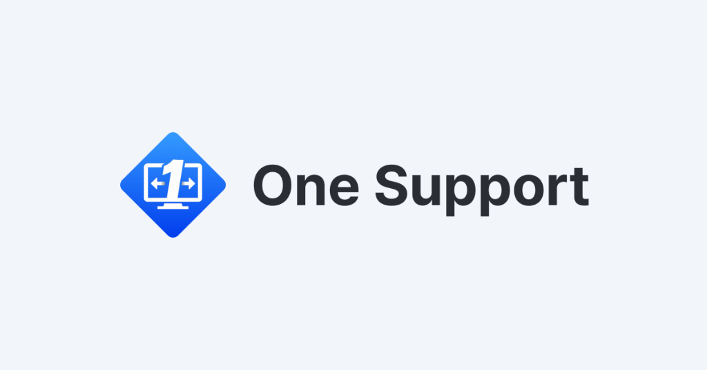

<p align="center">
  <br>
  <a href="#raw-steps-to-build">Build</a> •
  <a href="#file-structure">Structure</a> •
  <a href="#client-for-users">Client for Users</a><br>
</p>

# One Support Window Manager

**One Support Window Manager** is a customized remote desktop solution based on [RustDesk](https://github.com/rustdesk/rustdesk).
This project is open-source and licensed under the **GNU Affero General Public License v3 (AGPL-3.0)**.

> [!IMPORTANT]
> **Attribution**: This software is a fork of RustDesk. We respect the original work and the open-source community.
> The full source code and modifications are available in this repository in compliance with the AGPL-3.0 license.

---

### 🇰🇷 한국어 소개 (Korean Introduction)

**One Support Window Manager**는 [RustDesk](https://github.com/rustdesk/rustdesk)를 기반으로 한 맞춤형 원격 데스크톱 솔루션입니다.
이 프로젝트는 오픈 소스이며 **GNU Affero General Public License v3 (AGPL-3.0)** 라이선스를 따릅니다.

> [!IMPORTANT]
> **저작권 고지**: 이 소프트웨어는 RustDesk의 포크(Fork) 버전입니다. 우리는 원작자의 작업과 오픈 소스 커뮤니티를 존중합니다.
> 전체 소스 코드와 수정 사항은 AGPL-3.0 라이선스에 따라 이 저장소에 공개되어 있습니다.

## License / 라이선스
This project is licensed under the **AGPL-3.0** license. See the [LICENCE](LICENCE) file for details.
If you use this software to provide a service over a network, you are obligated to make the source code available to your users.

이 프로젝트는 **AGPL-3.0** 라이선스를 따릅니다. 자세한 내용은 [LICENCE](LICENCE) 파일을 참고하세요.
네트워크를 통해 이 소프트웨어를 서비스 형태로 제공하는 경우, 사용자에게 반드시 소스 코드를 공개할 의무가 있습니다.

## Features / 주요 기능
- **Based on RustDesk**: Inherits the security and speed of RustDesk.
  - **RustDesk 기반**: RustDesk의 강력한 보안과 빠른 속도를 계승합니다.
- **Customized for One Support**: Tailored UI and features for our specific use cases.
  - **One Support 맞춤화**: 전용 UI와 운영에 필요한 기능들이 최적화되어 있습니다.
- **Self-Hosted Ready**: Designed to work with your own self-hosted server infrastructure.
  - **자체 호스팅(Self-Hosted)**: 자체 서버 인프라에서 완벽하게 작동하도록 설계되었습니다.

## Dependencies & Build / 빌드 방법

One Support Window Manager builds similarly to the original RustDesk.

**Build Requirements:**
- Rust development environment
- C++ build environment
- [vcpkg](https://github.com/microsoft/vcpkg)
- Sciter dynamic library (for the legacy UI, if used) or Flutter environment.

**Windows Build (Simplified):**
1. Install `vcpkg` and set `VCPKG_ROOT`.
   ```cmd
   vcpkg install libvpx:x64-windows-static libyuv:x64-windows-static opus:x64-windows-static aom:x64-windows-static
   ```
2. Run generic build:
   ```cmd
   cargo run
   ```

For detailed build instructions for Linux/macOS and Docker, please refer to the [original RustDesk documentation](https://rustdesk.com/docs/en/dev/build/) or the sections below.

## File Structure

- **[libs/hbb_common](libs/hbb_common)**: Core utilities, codec, config.
- **[libs/scrap](libs/scrap)**: Screen capture logic.
- **[src/server](src/server)**: Service logic for audio/input/video.
- **[src/client.rs](src/client.rs)**: Peer connection logic.
- **[flutter](flutter)**: Flutter UI code (Primary UI).

---
*This project is not affiliated with the official RustDesk team but is developed using their open-source code under AGPL-3.0.*


